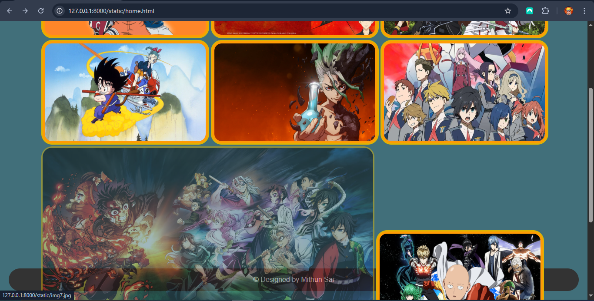

# Ex.08 Design of Interactive Image Gallery
## Date:

## AIM:
To design a web application for an inteactive image gallery with minimum five images.

## DESIGN STEPS:

### Step 1:
Clone the github repository and create Django admin interface.

### Step 2:
Change settings.py file to allow request from all hosts.

### Step 3:
Use CSS for positioning and styling.

### Step 4:
Write JavaScript program for implementing interactivity.

### Step 5:
Validate the HTML and CSS code.

### Step 6:
Publish the website in the given URL.

## PROGRAM :
```
home.html
<!DOCTYPE html>
<html lang="en">
<head>
    <link rel="stylesheet" type="text/css" href="styles.css">
    <meta charset="UTF-8">
    <meta name="viewport" content="width=device-width, initial-scale=1.0">
    <title>Document</title>
</head>
<body>

    <div class="navbar" >
        
        <a>My anime Gallery</a>
    </div>

    
    <div class="menuitems">
        <a href="img1.jpg"> </a>
        <a href="img2.avif"></a>
        <a href="img3.jpg"></a>
        <a href="img4.jpg"></a>
        <a href="img5.jpg"></a>
        <a href="img6.webp"></a>
        <a href="img7.jpg"></a>
        <a href="img8.jpg"></a>
        <a href="img9.jpg"></a>
    </div>

    <div class="ending">
        <p id="author">&copy; Designed by Mithun Sai</p>
    </div>
</body>
</html>


styles.css
body {
    margin: 0;
    font-family: Arial, sans-serif;
    background-color: rgb(65, 111, 122);
    }

.navbar {
    margin: 10px;
    border-radius: 100px;
    display: flex;
    justify-content: center; 
    align-items: stretch;
    background-color: #333;
    padding: 10px 20px;
    }

.navbar img{
    width:auto;
    height: 5vh;
    margin-right:auto;
}

.navbar a {
    color: rgb(255, 255, 255);
    text-decoration: none;
    padding: 10px 15px;
    display: block;
    }


.ending{
    top: 20vh;
    margin:20px;
    text-align: center;
    border-radius: 100px;
    background-color: #333;
    margin-top: 1px;
    padding:1px;
    color: #ffffff;
}

.menuitems{
    justify-items: center;
    justify-content: center;
    align-items: center;    
    padding-left:7%;
    height: 770px;
}

.menuitems img{
    border: 3px solid rgb(220, 180, 4);
    background-color: rgb(255, 155, 4);
    border-radius:25px;
    display:flexbox;
    flex:33.33%;
    width: 370px;
    height:225px;
    padding:5px;
    }
.menuitems img:active{
    padding:0%;
    width:760px;
    height:auto;
    transition-duration:0.25s;
}

.menuitems img:hover{
    opacity: 0.5;
}
```

## OUTPUT:





## RESULT:
The program for designing an interactive image gallery using HTML, CSS and JavaScript is executed successfully.
